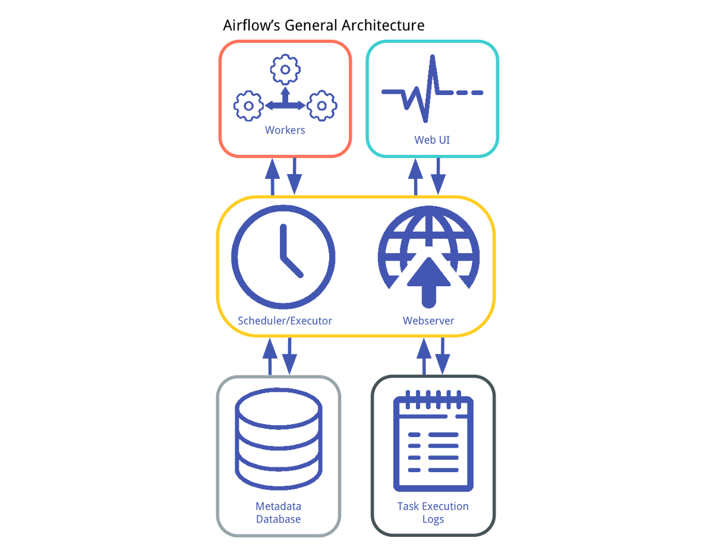

# Airflow Codebase Template

### Background

Apache Airflow is the leading orchestration tool for batch workloads. Originally conceived at Facebook and eventually open-sourced at AirBnB, Airflow allows you to define complex directed acyclic graphs (DAG) by writing simple Python. 

Airflow has a number of built-in concepts that make data engineering simple, including DAGs (which describe how to run a workflow) and Operators (which describe what actually gets done). See the Airflow documentation for more detail: https://airflow.apache.org/concepts.html 

Airflow also comes with its own architecture: a database to persist the state of DAGs and connections, a web server that supports the user-interface, and workers that are managed together by the scheduler and database. Logs persist both in flat files and the database, and Airflow can be setup to write remote logs (to S3 for example). Logs are viewable in the UI.

### Getting Started

This repository was created with `Python 3.8.6`, but should work for all versions of Python 3. 

DAGs should be developed & tested locally first, before being promoted to a development environment for integration testing. Once DAGs are successful in the lower environments, they can be promoted to production. 

Code is contributed either in `dags`, a directory that houses all Airflow DAG configuration files, or `plugins`, a directory that houses Python objects that can be used within a DAG. Essentially, if you want to abstract something out for reuse in other pipelines, it should probably go in `plugins`. 

### Running Airflow locally

This project uses a Makefile to consolidate common commands and make it easy for anyone to get started. To run Airflow locally, simply:

        make start-airflow

This command will create your virtual environment if it doesn't already exist, install the proper packages, set your Fernet key in `.env` if it doesn't already exist, and of course start Airflow. 

Navigate to http://localhost:8080/ and start writing & testing your DAGs!

You'll notice in `docker-compose.yaml` that both DAGs and plugins are mounted as volumes. This means once Airflow is started, any changes to your code will be quickly synced to the webserver and scheduler. You shouldn't have to restart the Airflow instance during a period of development! 

When you're done, simply:

        make airflow-down

### Testing & Linting

This project is also fully linted with black and pylint, even using a cool pylint plugin called [pylint-airflow](https://pypi.org/project/pylint-airflow/). To run linting:

        make lint

Any tests can be placed under `tests`, we've already included a few unit tests for validating all of your DAGs and plugins to make sure they're valid to install in Airflow. You can run them all with:

        make test

### Cleaning up your local environment

If at any point you simply want to clean up or reset your local environment, you can run the following commands:

Reset your local docker-compose:

        make reset-airflow

Clean up Pytest artifacts:
        
        make clean-pytest

Reset your virtual environment:

        make clean-venv

Reset your Fernet key:

        rm .env
        make set-fernet-key

Start completely from scratch:

        make clean-all

### Deployment

Once you've written your DAGs, the next step is to deploy them to your Airflow instance. This is a matter of syncing the `dags` and `plugins` directories to their respective destinations. 

TODO: add some examples and documentation of deployments to different Airflow cloud providers (Astronomer, Cloud Composer, etc.) using different CI technologies (CircleCI, Github Actions, etc.)
